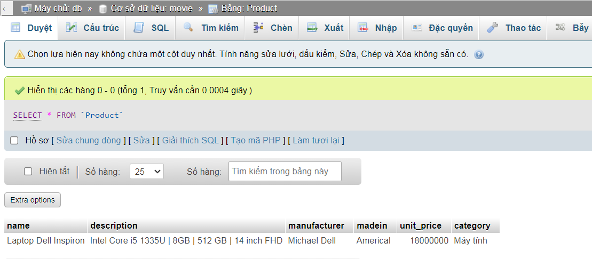

Tạo bảng Post
```sql
create table Post(
title varchar(250), 
content text, 
created DATETIME, 
author varchar(100), 
category set('Sport','Politics','Health','Tourism','Economy','Education','Technology','Science'), 
is_published boolean 
);
```
Chèn dữ liệu vào bảng Post
```sql
insert into movie.Post(title,author,created,content,category,is_published)
values('Experiences for backpacking trip','motogo','2021-07-01 9:42:05','Buy cheap tickets now,Light luggage','Tourism',1);

```
<!--  -->

Tạo bảng Product
```sql
create table Product(
    name varchar(300),
    description text,
    manufacturer varchar(250),
    madein varchar(100),
    unit_price int,
    category set('Quần áo','Mỹ phẩm','Đồ chơi','Dụng cụ học tập','Máy tính','Di động','Điện tự dân dụng','Văn phòng')
    );
```

Chèn dữ liệu vào bảng Product
```sql
insert into movie.Product(name,description,madein,manufacturer,unit_price,category)
       values('Laptop Dell Inspiron','Intel Core i5 1335U | 8GB | 512 GB | 14 inch FHD',
              'Americal','Michael Dell','18000000','Máy tính')
```
<!--  -->
