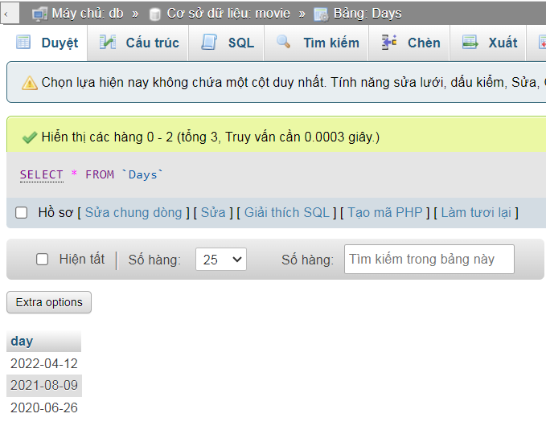
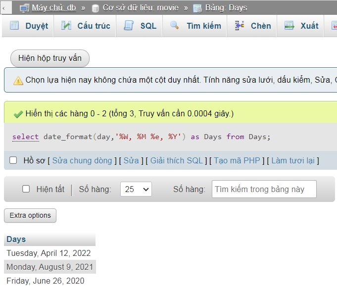
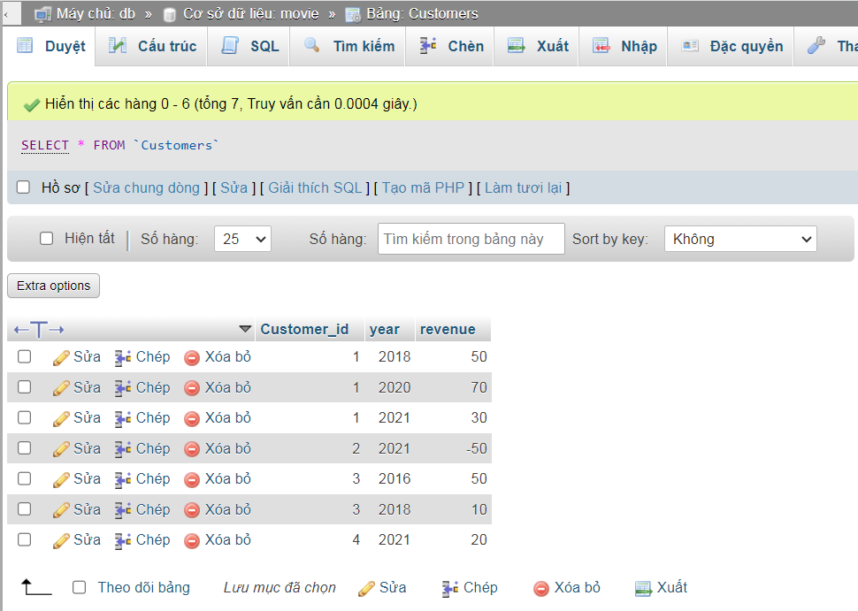
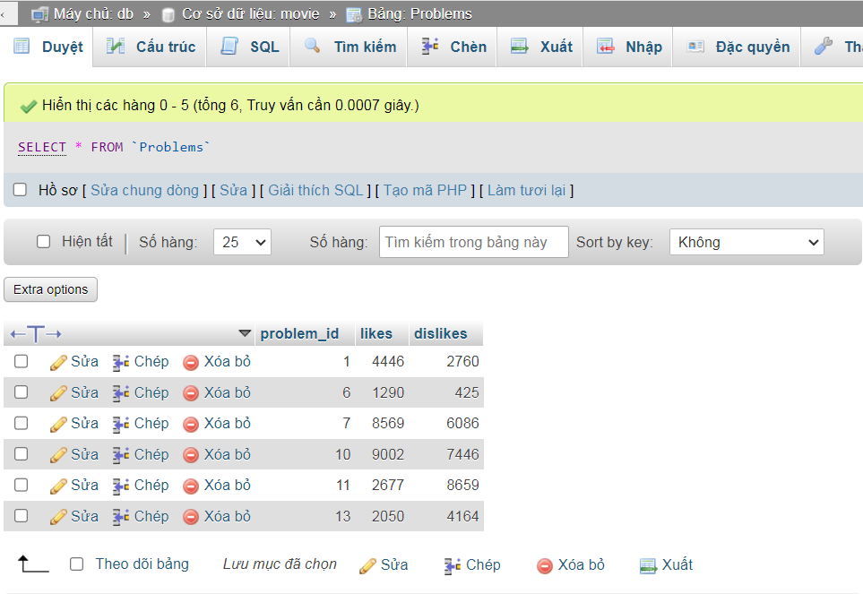
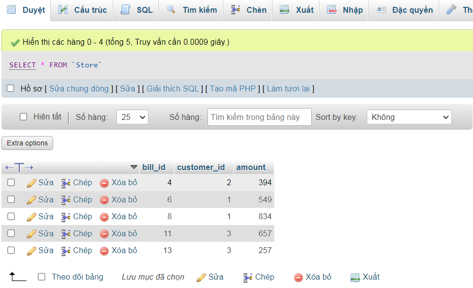
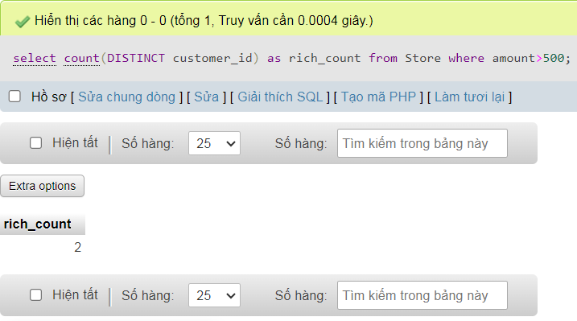
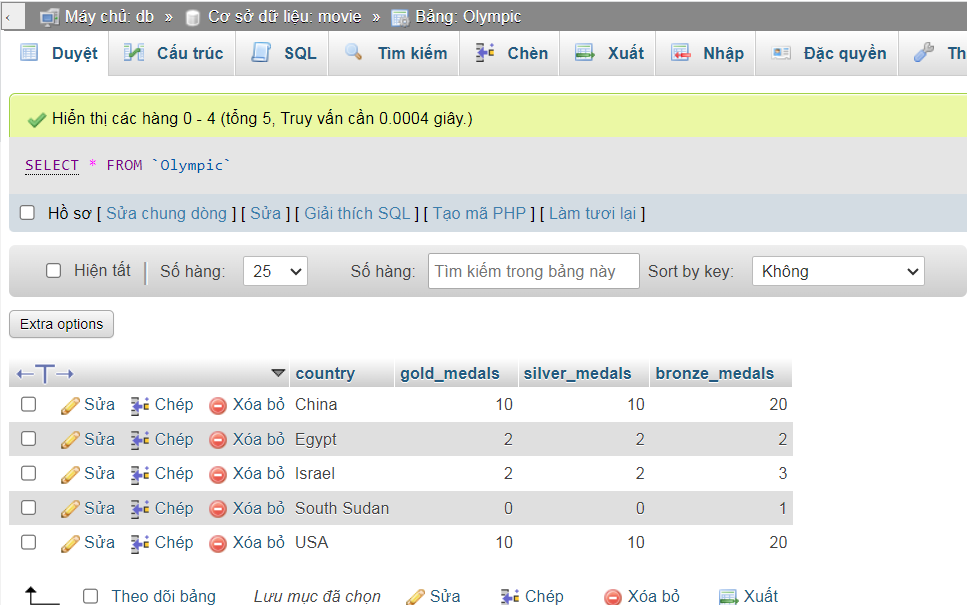
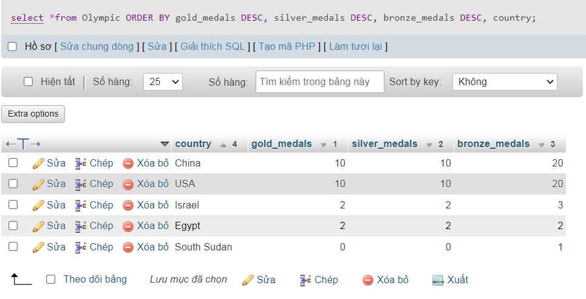

### 1853. Convert Date Format
      


```sql
select date_format(day,'%W, %M %e, %Y') as Days from Days
``` 



### 1821. Find Customers With Positive Revenue this Year
Tạo bảng
```sql
create table Customers(
    customer_id int primary key,
    year int ,
    revenue int
    );
```


```sql
select Customer_id from Customers where revenue>0 and year=2021
```


### 2026. Low-Quality Problems
Tạo bảng
```sql
create table Problems(
    problem_id int primary key,
    likes int,
    dislikes int
    );
```


```sql
select problem_id from Problems where (likes/(likes+dislikes))<0.6 order by problem_id asc
```


### 2082. The Number of Rich Customers
Tạo bảng
```sql
create table Store(
    bill_id int primary key,
    customer_id int,
    amount int
    );
```


```sql
select count(DISTINCT customer_id) as rich_count  
from Store where amount>500 
```



### 2377. Sort the Olympic Table
Tạo bảng
```sql
create table Olympic(
    country varchar(50) primary key,
    gold_medals int,
    silver_medals int,
    bronze_medals int
    );
```


```sql
select *from Olympic 
ORDER BY gold_medals DESC, silver_medals DESC, bronze_medals DESC, country;
```

