### 595. Big Countries
```sql
select name,population,area from World 
where area >=3000000 or population >=25000000
```
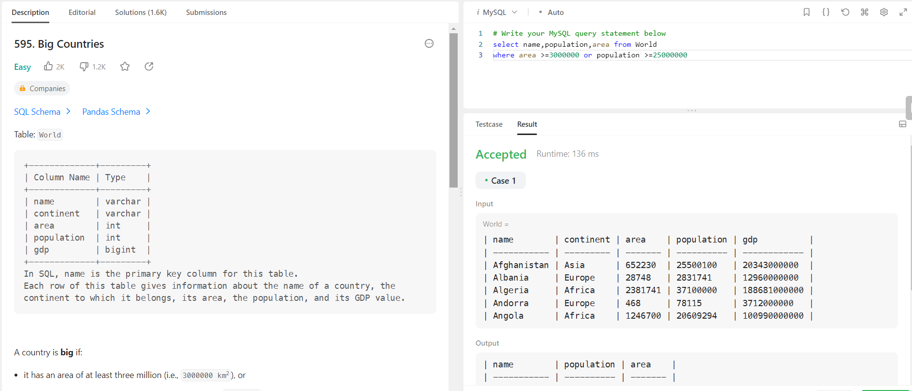


### 1890. The Latest Login in 2020
```sql
select user_id, max(time_stamp) as last_stamp
from Logins 
where Year(time_stamp)=2020
group by user_id
```
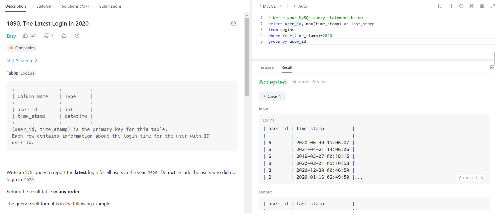


### 620. Not Boring Movies
```sql
select *from Cinema 
where (id % 2 !=0) and description not in('boring')
order by rating desc
```
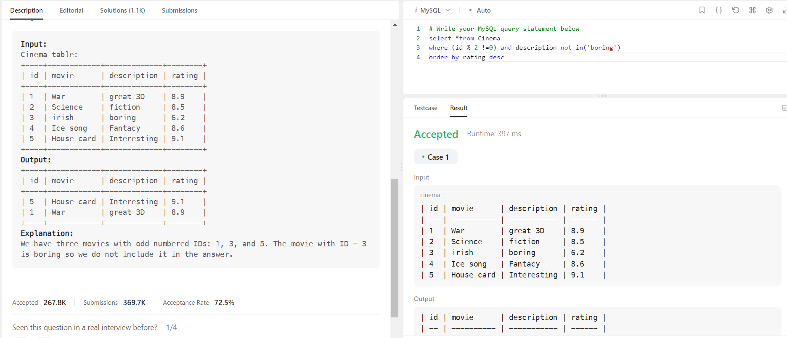


### 610. Triangle Judgement
```sql
select x,y,z,
case 
when ((x+y)>z and (x+z)>y and (y+z)>x) then 'Yes'
else 'No'
end as triangle
from Triangle
```
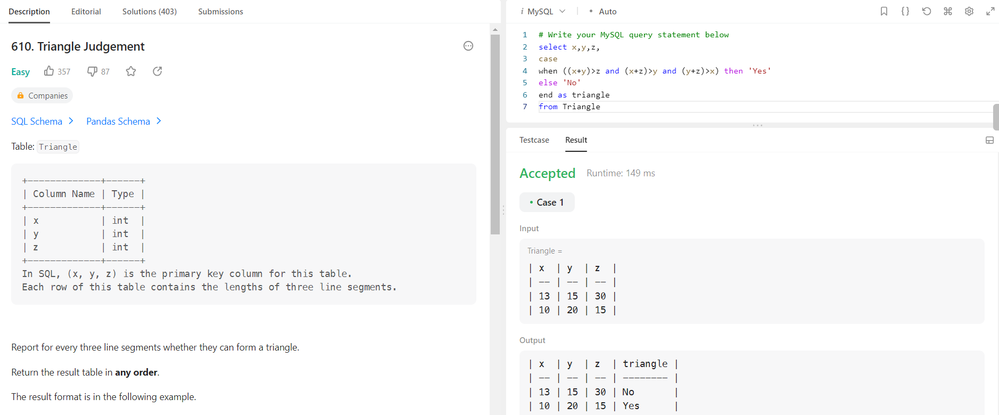


### 1729. Find Followers Count
```sql
select user_id, count(follower_id) as followers_count
from Followers
group by user_id
order by followers_count asc
```
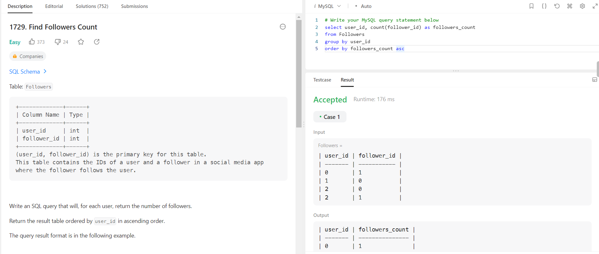


### 1050. Actors and Directors Who Cooperated At Least Three Times
```sql
select actor_id,director_id from ActorDirector
group by actor_id,director_id
having count(timestamp)=3
```
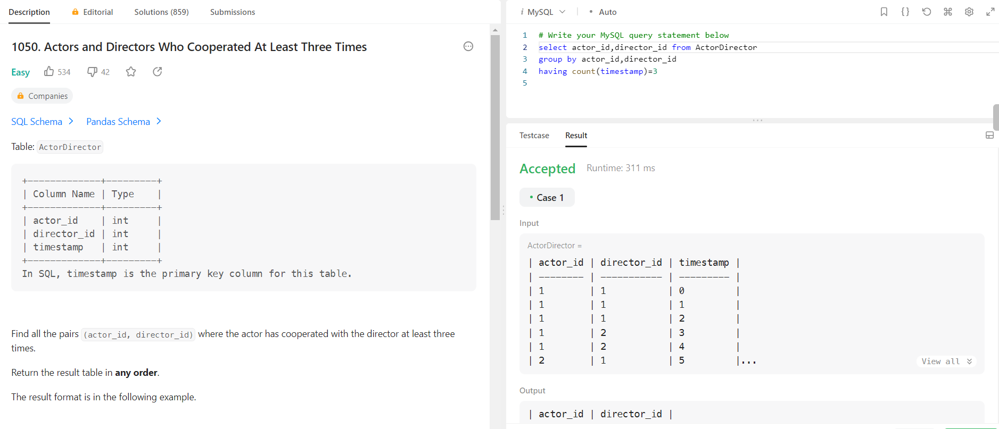


### 1484. Group Sold Products By The Date
```sql
select sell_date,count(distinct product) as num_sold,
group_concat(distinct product order by product asc separator ',') as products
from Activities 
group by sell_date
order by sell_date asc
```
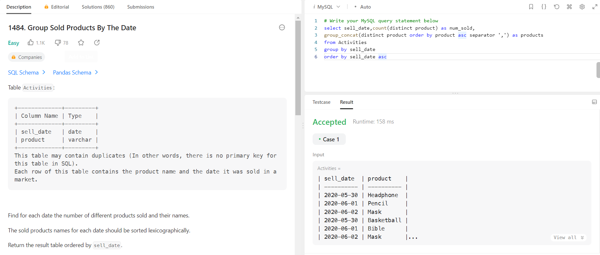

### 511. Game Play Analysis I
```sql
select player_id,min(event_date) as first_login
from Activity 
group by player_id
```
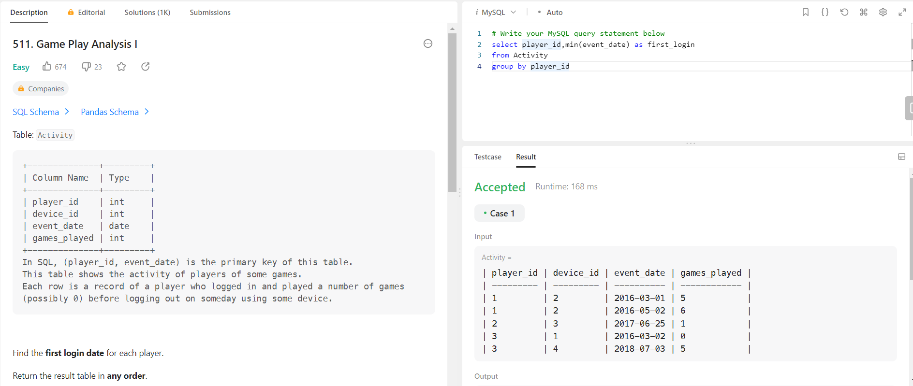


### 175. Combine Two Tables
```sql
select p.firstName,p.lastName,a.city,a.state 
from Person p left join Address a on p.personId=a.personId
```
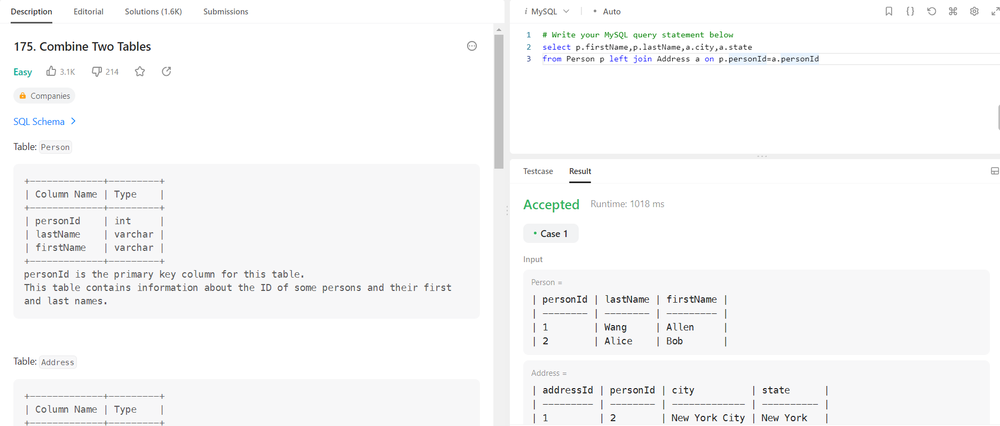


### 1757. Recyclable and Low Fat Products
```sql
select product_id from Products
where low_fats='Y' and recyclable='Y'
```
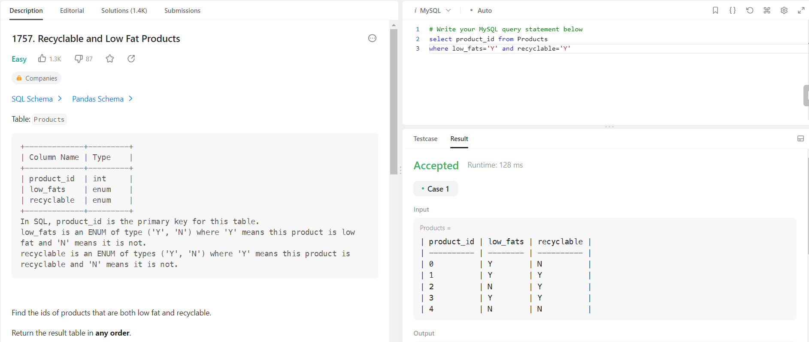


### 1741. Find Total Time Spent by Each Employee
```sql
select event_day as day,emp_id,sum((out_time-in_time)) as total_time
from employees
group by emp_id,event_day
```
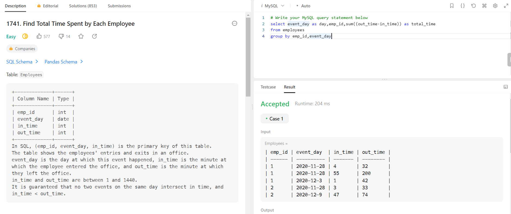


### 1693. Daily Leads and Partners
```sql
select date_id,make_name,count(distinct lead_id) as unique_leads,count(distinct partner_id) as unique_partners
from DailySales
group by date_id,make_name;
```
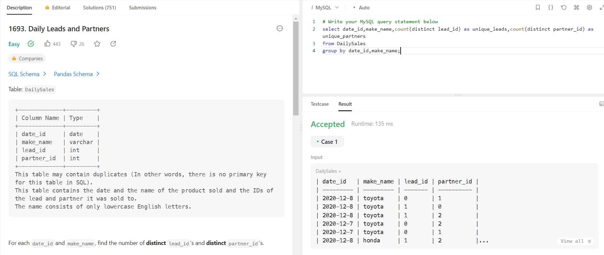


### 2356. Number of Unique Subjects Taught by Each Teacher
```sql
select teacher_id, count(distinct subject_id) as cnt
from Teacher
group by teacher_id
```
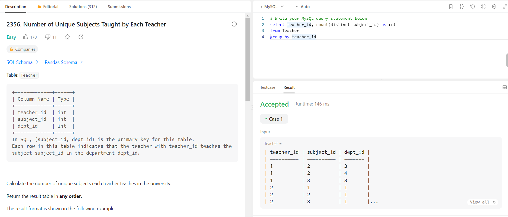

### 1795. Rearrange Products Table
```sql
select product_id,'store1' as store ,store1 as price from Products
where store1 is not null
union all
select product_id,'store2' as store ,store2 as price from Products
where store2 is not null
union all
select product_id,'store3' as store ,store3 as price from Products
where store3 is not null
order by product_id asc
```
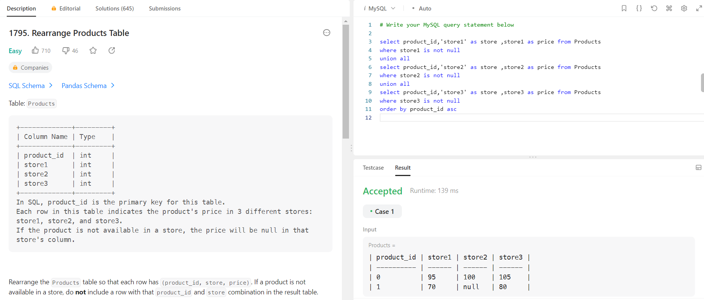


### 1082. Sales Analysis I
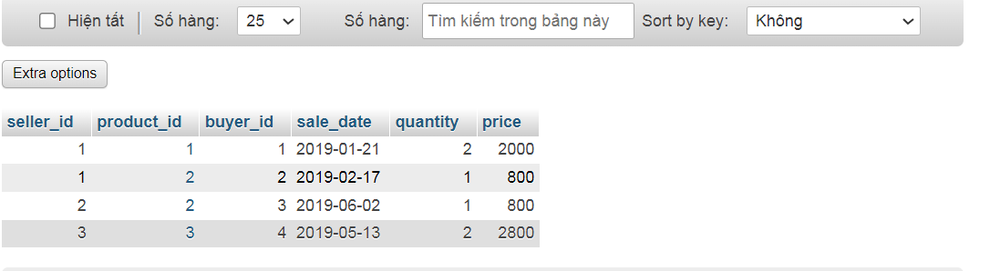
```sql
select seller_id 
from Sales
group by seller_id
having sum(price)=(
select max(total_price) 
from(
select sum(price) as total_price
from Sales
group by seller_id) as total_price
)
```
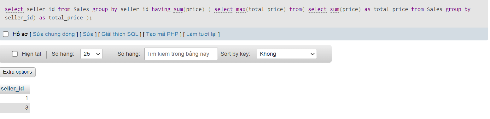

### 2072. The Winner University
```sql
WITH Excellent AS(
select 'New York University' as university,count(score) as excellent_Student from NewYork where score>=90
union all 
select 'California University' as university,count(score) as excellent_Student from California where score>=90
    )
    select 
    case 
     when max(excellent_Student)=(select excellent_Student from Excellent where university='New York University') and max(excellent_Student)=(select excellent_Student from Excellent where university='California University') then'No winner'
    when max(excellent_Student)=(select excellent_Student from Excellent where university='New York University')
    then 'New York University'
     when max(excellent_Student)=(select excellent_Student from Excellent where university='California University')
    then 'California University'
    end as 'winner'
    from Excellent
   
```
### EX1
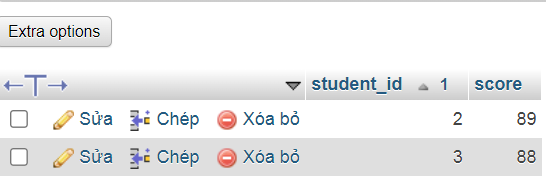

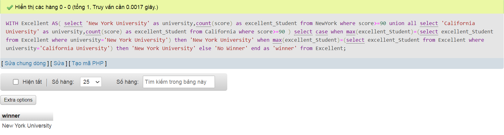

### EX2 

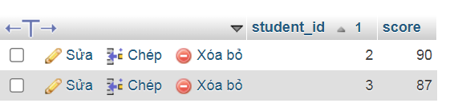
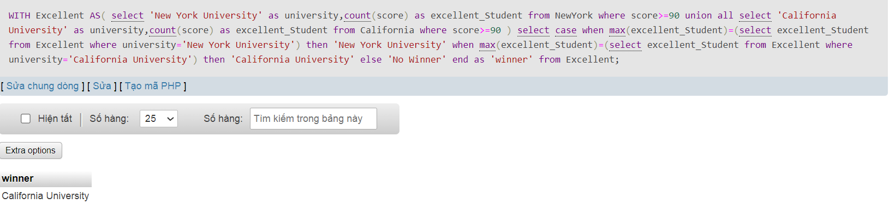

### EX3


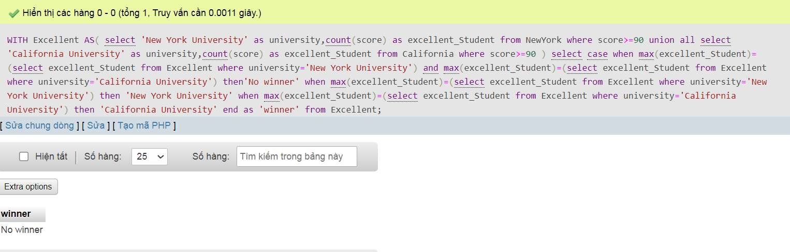


