### 2356. Number of Unique Subjects Taught by Each Teacher
```sql
select teacher_id, count(distinct subject_id) as cnt
from Teacher
group by teacher_id
```
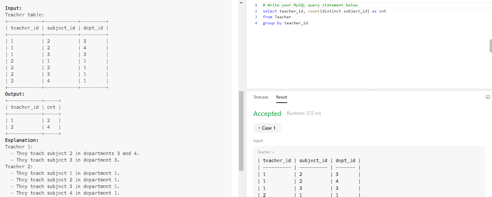

### 1378. Replace Employee ID With The Unique Identifier
```sql
select eu.unique_id,es.name from Employees es
LEFT JOIN EmployeeUNI eu on es.id=eu.id
```
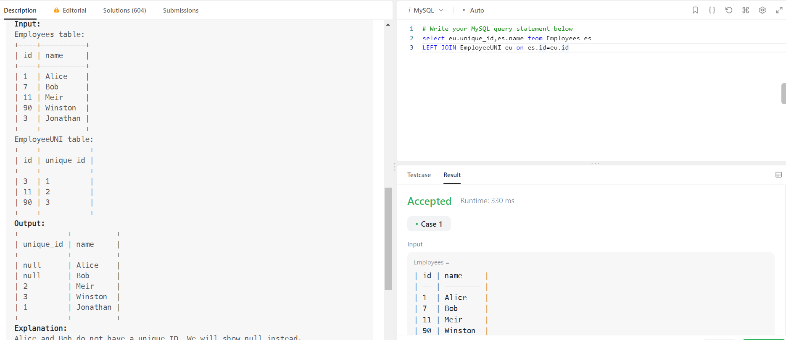

### 1683. Invalid Tweets
```sql
select tweet_id from Tweets
where char_length(content)>15
```
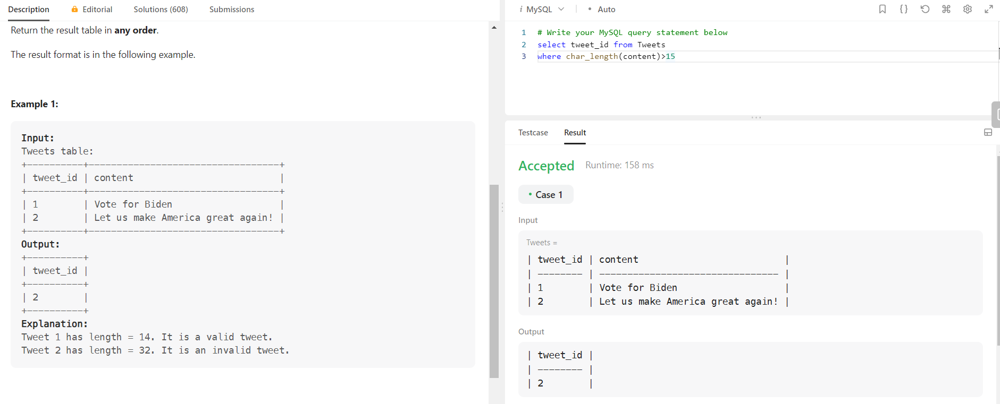

### 1795. Rearrange Products Table
```sql
select product_id,'store1' as store ,store1 as price from Products
where store1 is not null
union all
select product_id,'store2' as store ,store2 as price from Products
where store2 is not null
union all
select product_id,'store3' as store ,store3 as price from Products
where store3 is not null
order by product_id asc
```
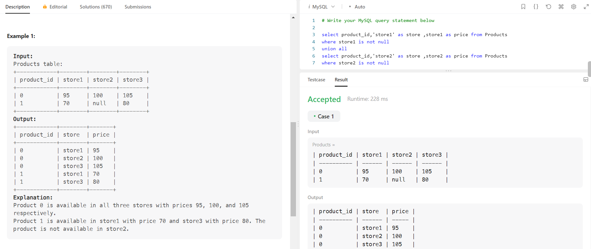

### 1587. Bank Account Summary II
```sql
select u.name,sum(t.amount) as balance from Users u
inner join Transactions t on u.account=t.account
group by t.account
having balance> 10000
```
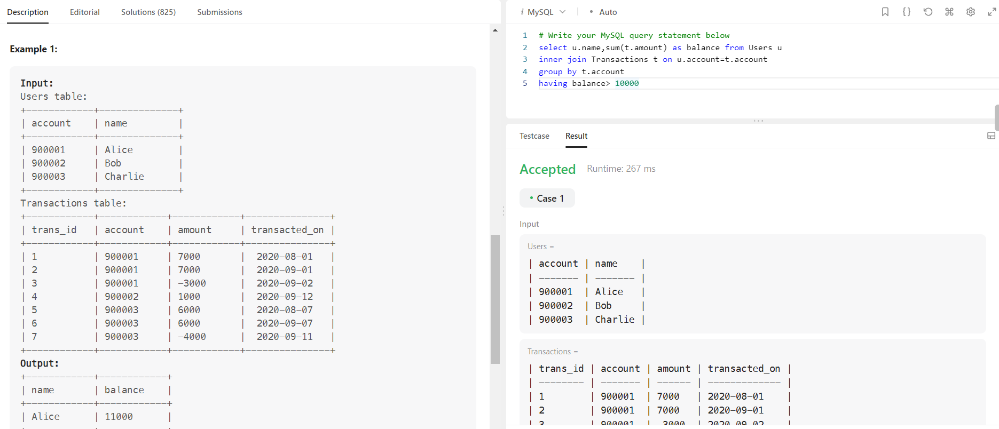

### 627. Swap Salary
```sql
update salary set sex=
case 
when sex='m' then 'f'
else 'm'
end
```
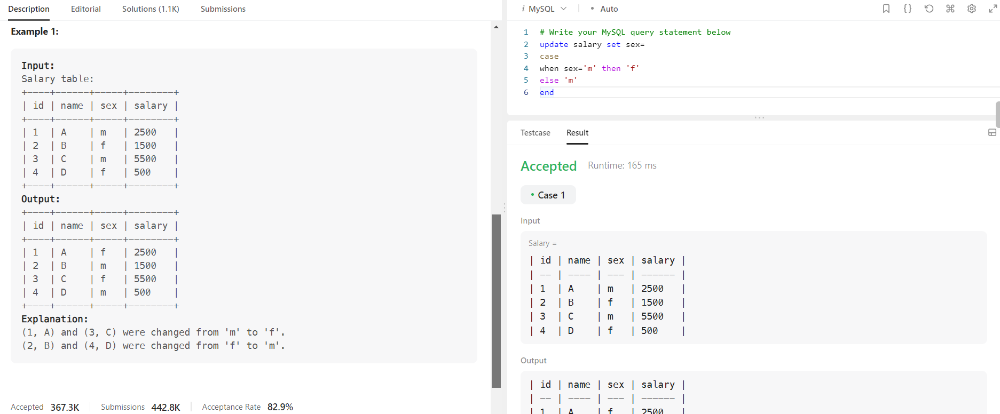

### 1068. Product Sales Analysis I
```sql
select p.product_name,s.year,s.price
from Sales s inner join Product p
on s.product_id=p.product_id
```
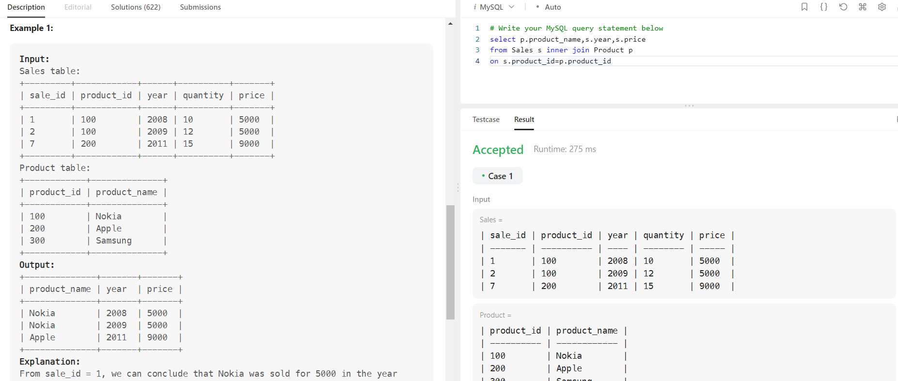

### 1581. Customer Who Visited but Did Not Make Any Transactions
```sql
select customer_id, count(visit_id) as count_no_trans 
from Visits
where visit_id not in(select t.visit_id 
from Visits v inner join Transactions t
on v.visit_id=t.visit_id)
group by customer_id
```
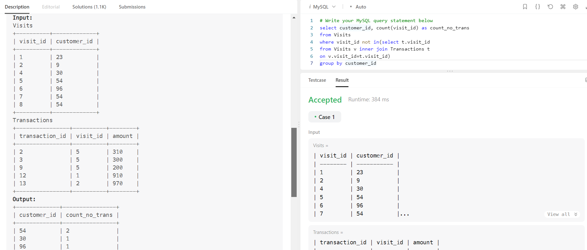

### 1179. Reformat Department Table
```sql
select id,
    max(case when month='Jan' then revenue end) as Jan_Revenue,
    max(case when month='Feb' then revenue end) as Feb_Revenue,
    max(case when month='Mar' then revenue end) as Mar_Revenue,
    max(case when month='Apr' then null end) as Apr_Revenue,
    max(case when month='May' then null end) as May_Revenue,
    max(case when month='Jun' then null end) as Jun_Revenue,
    max(case when month='Jul' then null end) as Jul_Revenue,
    max(case when month='Aug' then null end) as Aug_Revenue,
    max(case when month='Sep' then null end) as Sep_Revenue,
    max(case when month='Oct' then null end) as Oct_Revenue,
    max(case when month='Nov' then null end) as Nov_Revenue,
    max(case when month='Dec' then null end) as Dec_Revenue
    from Department
    group by id

```
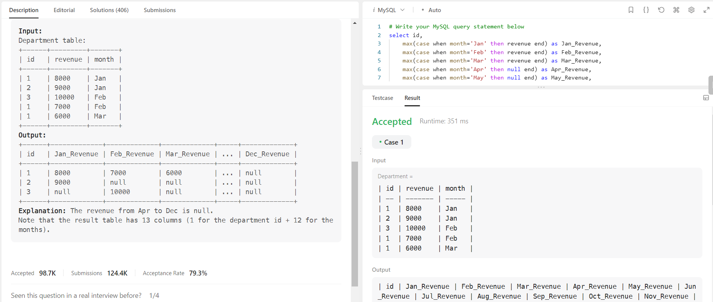

### 1484. Group Sold Products By The Date
```sql
select sell_date,count(distinct product) as num_sold,
group_concat(distinct product order by product asc separator ',') as products
from Activities 
group by sell_date
order by sell_date asc
```
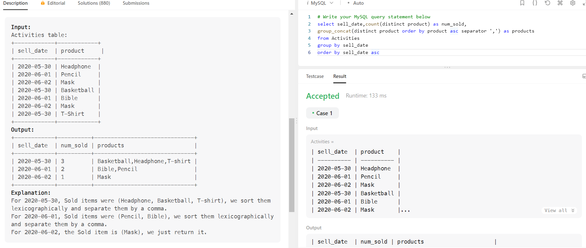

### 1890. The Latest Login in 2020
```sql
select user_id, max(time_stamp) as last_stamp
from Logins 
where Year(time_stamp)=2020
group by user_id
```
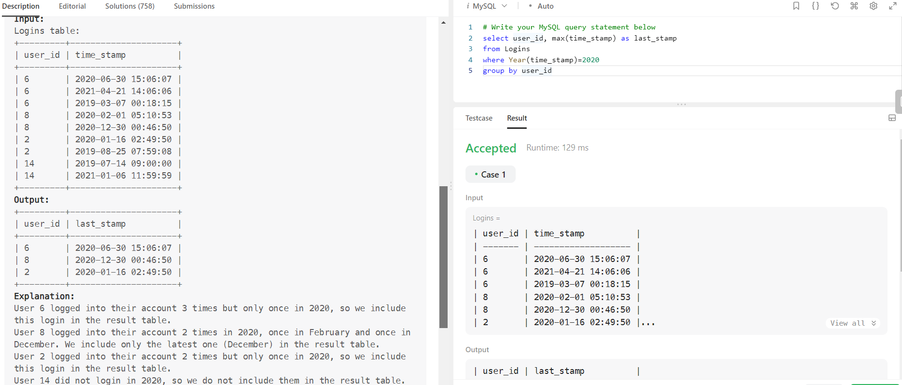

### 1251. Average Selling Price
```sql
SELECT  u.product_id,Round((sum(p.price*u.units)/sum(u.units)),2) as average_price FROM UnitsSold u
inner join Prices p ON u.product_id = p.product_id
where u.purchase_date >= p.start_date AND u.purchase_date <= p.end_date
group by u.product_id
```
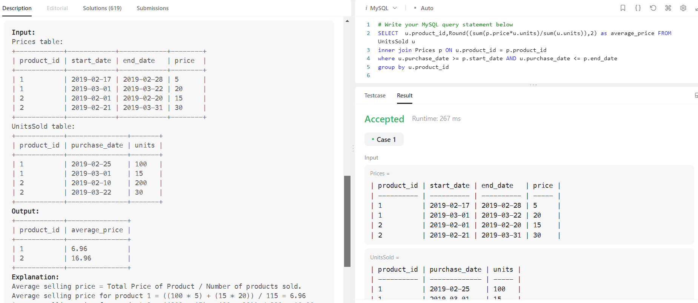

### 1789. Primary Department for Each Employee
```sql
SELECT DISTINCT employee_id, department_id
FROM Employee
WHERE employee_id IN (
    SELECT employee_id
    FROM Employee
    GROUP BY employee_id
    HAVING COUNT(*) = 1
  )
  OR primary_flag = 'Y'
ORDER BY employee_id;
```
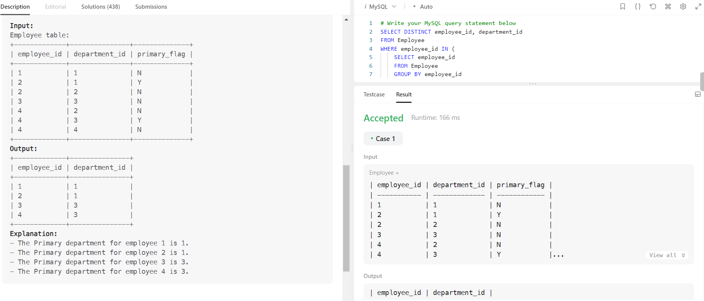
