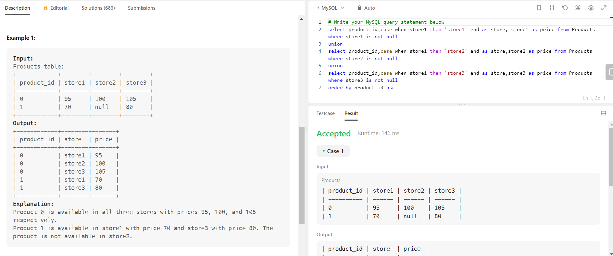

### 1378. Replace Employee ID With The Unique Identifier


### 1795. Rearrange Products Table


### 1587. Bank Account Summary II


### 1581. Customer Who Visited but Did Not Make Any Transactions


### 1251. Average Selling Price


### Leet Code Premium

### 1303. Find the Team Size
```sql
with etc as(
select team_id,count(team_id) as team_size  FROM
Employee 
group by team_id
    )
  select e.employee_id, et.team_size
  from Employee e inner join etc et 
  on e.team_id=et.team_id
```


### 1571. Warehouse Manager
```sql
select w.name as warehouse_name,
sum(w.units*p.Width*p.length*p.height) as volume 
from Warehouse w inner join Products p 
on w.product_id=p.product_id
group by w.name
```


### 2339. All the Matches of the League
```sql
select  t1.team_name as home_team, t2.team_name as away_team from Teams t2
cross join Teams t1
where t1.team_name !=t2.team_name
```


### 1623. All Valid Triplets That Can Represent a Country
```SQL
select a.student_name as member_A,b.student_name as member_B, c.student_name as member_C from SchoolA a inner join SchoolB b 
on a.student_id!=b.student_id
inner join SchoolC c on b.student_id!=c.student_id and a.student_id!=c.student_id
Where a.student_name!=b.student_name
and b.student_name!=c.student_name
and c.student_name!=a.student_name
```


### 1421. NPV Queries
```sql
select q.id,q.year,case when n.npv is null then '0' else n.npv end as nvp from Queries q left join NPV n on n.id=q.id and q.year=n.year
```


### 1069. Product Sales Analysis II
```sql
select s.product_id,sum(s.quantity) as product_name from Sales s inner join Product p 
on s.product_id=p.product_id
group by s.product_id
```

