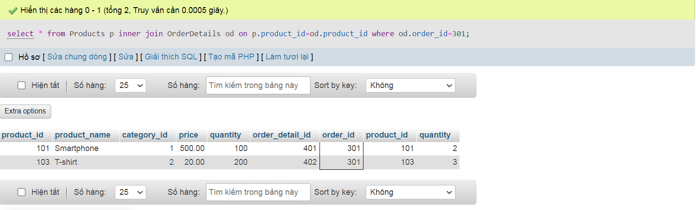
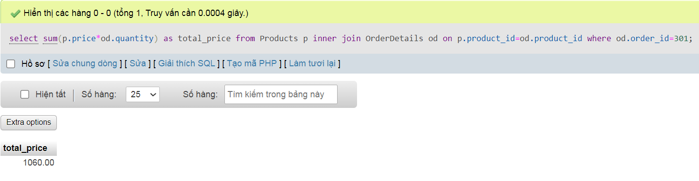
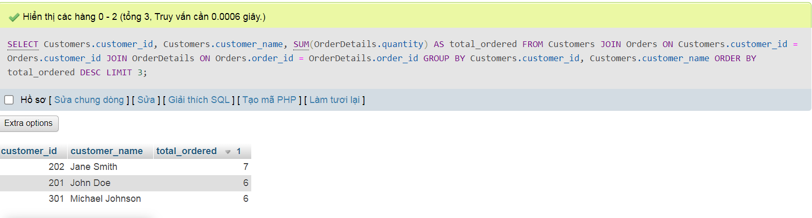

### 1.Lấy thông tin tất cả các sản phẩm đã được đặt trong một đơn đặt hàng cụ thể.
```sql
select * from Products p inner join OrderDetails od on p.product_id=od.product_id
where od.order_id=301
```


### 2.Tính tổng số tiền trong một đơn đặt hàng cụ thể.
```sql
select sum(p.price*od.quantity) as total_price from Products p inner join OrderDetails od on p.product_id=od.product_id
where od.order_id=301

```


### 3.Lấy danh sách các sản phẩm chưa có trong bất kỳ đơn đặt hàng nào.
```sql
select * from Products p left join OrderDetails od on p.product_id=od.product_id
where od.order_id is null

```


### 4.Đếm số lượng sản phẩm trong mỗi danh mục. (category_name, total_products)
```sql
select c.category_name,count(p.product_id) as total_products from Categories c 
inner join Products p on c.category_id=p.category_id
group by c.category_id
```


### 5.Tính tổng số lượng sản phẩm đã đặt bởi mỗi khách hàng (customer_name, total_ordered)
```sql
select c.customer_name,sum(od.quantity) as total_ordered from Customers c inner join 
Orders o on c.customer_id=o.customer_id
inner join OrderDetails od on o.order_id=od.order_id
group by c.customer_id
```


### 6.Lấy thông tin danh mục có nhiều sản phẩm nhất (category_name, product_count)
```sql
select c.category_name,count(p.product_id) as product_count from Categories c inner join Products p on c.category_id=p.category_id
group by c.category_id
order by product_count desc
limit 1
```


### 7.Tính tổng số sản phẩm đã được đặt cho mỗi danh mục (category_name, total_ordered)
```sql
SELECT c.category_name, SUM(od.quantity) AS total_ordered
FROM Categories c
INNER JOIN Products p ON c.category_id = p.category_id
INNER JOIN OrderDetails od ON p.product_id = od.product_id
GROUP BY c.category_name;
```


### 8.Lấy thông tin về top 3 khách hàng có số lượng sản phẩm đặt hàng lớn nhất (customer_id, customer_name, total_ordered)
```sql
SELECT Customers.customer_id, Customers.customer_name, SUM(OrderDetails.quantity) AS total_ordered
FROM Customers
JOIN Orders ON Customers.customer_id = Orders.customer_id
JOIN OrderDetails ON Orders.order_id = OrderDetails.order_id
GROUP BY Customers.customer_id, Customers.customer_name
ORDER BY total_ordered DESC
LIMIT 3;

```


### 9.Lấy thông tin về khách hàng đã đặt hàng nhiều hơn một lần trong khoảng thời gian cụ thể (customer_id, customer_name, total_orders)
```sql
SELECT Customers.customer_id, Customers.customer_name, COUNT(DISTINCT Orders.order_id) AS total_orders
FROM Customers
INNER JOIN Orders ON Customers.customer_id = Orders.customer_id
INNER JOIN OrderDetails ON Orders.order_id = OrderDetails.order_id
WHERE Orders.order_date BETWEEN '2023-08-01' AND '2023-08-07'
GROUP BY Customers.customer_id, Customers.customer_name
HAVING total_orders > 1;
```


### 10.Lấy thông tin về các sản phẩm đã được đặt hàng nhiều lần nhất và số lượng đơn đặt hàng tương ứng (product_id, product_name, total_ordered)
```sql
SELECT Products.product_id, Products.product_name, COUNT(DISTINCT OrderDetails.order_id) AS total_ordered
FROM Products
INNER JOIN OrderDetails ON Products.product_id = OrderDetails.product_id
GROUP BY Products.product_id, Products.product_name
ORDER BY total_ordered DESC
Limit 3
```
```sql
SELECT Products.product_id, Products.product_name, COUNT(DISTINCT OrderDetails.order_id) AS total_ordered
FROM Products
INNER JOIN OrderDetails ON Products.product_id = OrderDetails.product_id
GROUP BY Products.product_id, Products.product_name
Having total_ordered =
(SELECT COUNT(DISTINCT OrderDetails.order_id) AS total_ordered
FROM Products
INNER JOIN OrderDetails ON Products.product_id = OrderDetails.product_id
GROUP BY Products.product_id 
ORDER BY total_ordered DESC
Limit 1)
```

